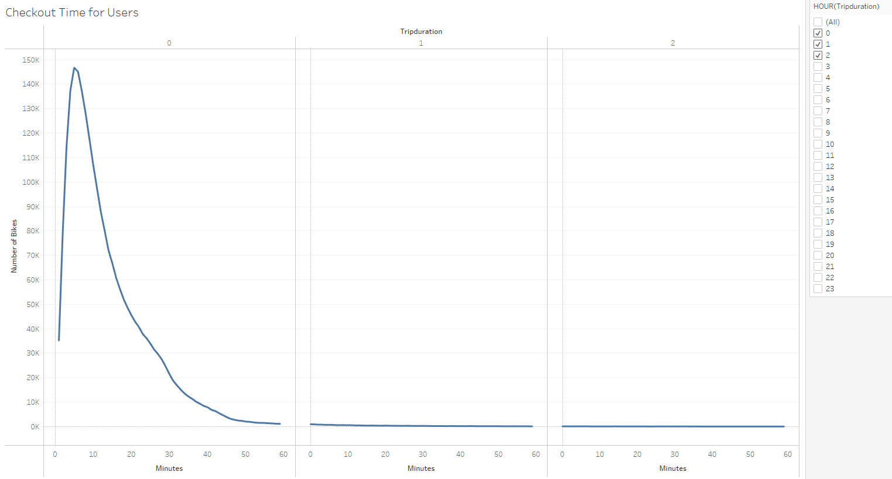
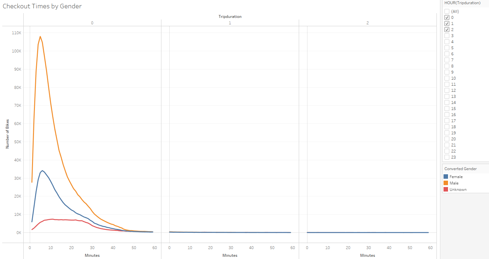
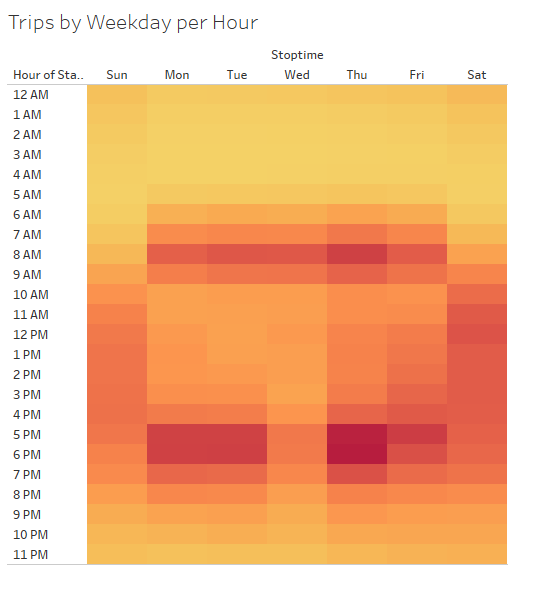
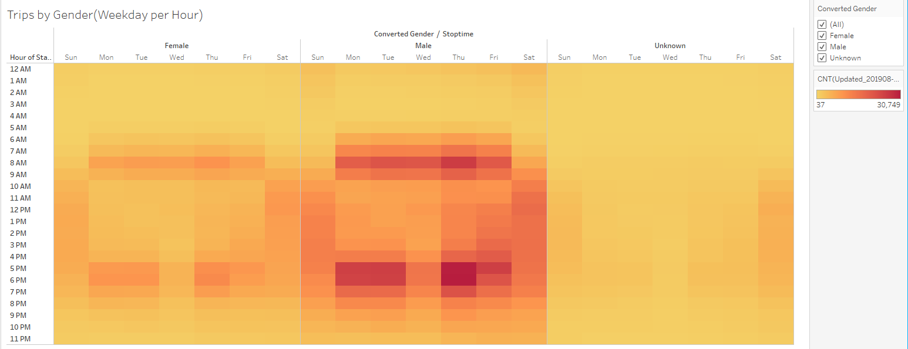
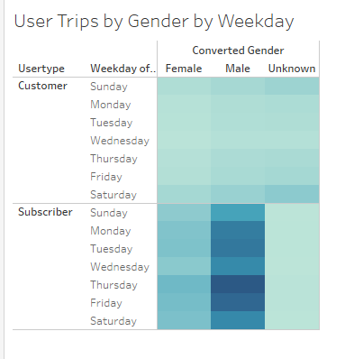
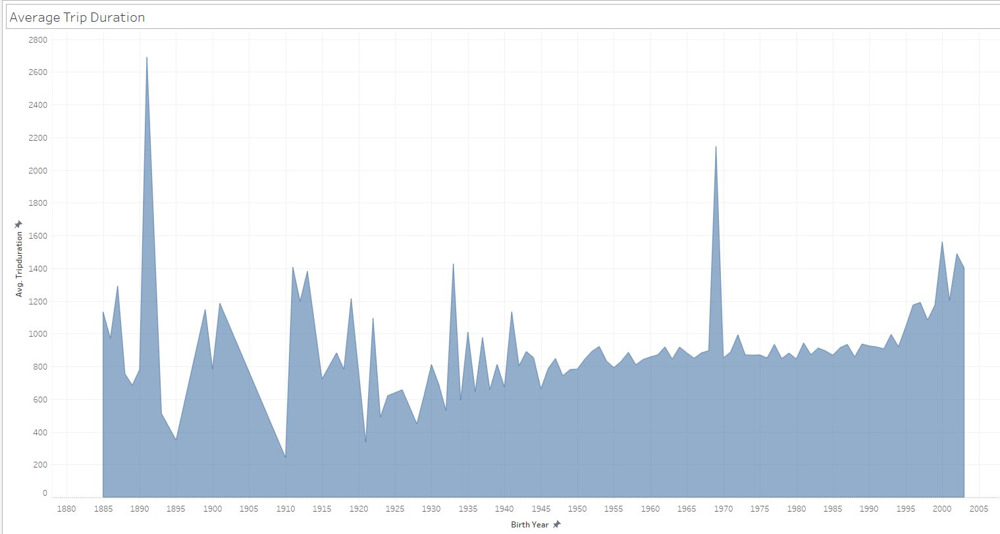
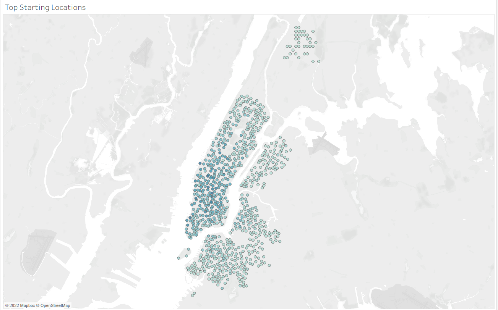

# Bikesharing
## Overview 
The purpose of this project was to provide an analysis of the New York Citi Bike sharing data for the month of August 2019 using visualizations so that it may provide insight on how beneficial it could be used in Des Moines, Iowa.
## Results
Below are the results of the analysis of the Citibike usage in New York City.

This visualization shows that peak usage occurs at 5 min. Most users utilize the bikes for 20min or less 

As noted in the graph, majority of the users checking out bikes tended to be male followed by female 108,087 males who checkout bikes compared to the 34,151 females.

Majority of the bikes are used between 5AM and 9 AM Weekdays and 4PM-9PM. On the weekends, bikes were used anywhere between 9AM and 8PM. 

The bikes are most popular amongst the male riders versus the female riders. On the weekends, while there are less riders, in terms of gender, there still was an increased number of males. Regardless of gender, the least amount of bike usage was between 12:00 AM and 5:00 AM, indicating this would be the best time for bike maintenance

Subscribers were the most frequent users of the citibike during the weekday, with Thursday being the most frequent days for bike usage. As noted in earlier graphs, males were the most frequent genders of the bike. On the weekends, there seems to be almost an equal number of subscribers and customers utilizing the bikes.

The average trip duration by birth year indicates that as the user age increase, the trip duration decreases. 

The top starting locations for majority of the bikes started out in New York City, while there were less outside of the city and on the outskirts of the city. 

## Summary
Overall, males were the more predominant gender of the citibike in New York with majority of the bikes being utilized in New York city. Subscribers were more frequent on the weekdays with peak usage being during travel time to and back from work/school. On the weekends, there seems to be more of a range of subscribers and customers, are more people are exploring the city
Additional visualizations that could be used to provide to investors in Des Moines include the population in the area where bikes are going to be stored. This would help identify if it is a popular area for usage as starting and ending points. Additionally, looking at the cost of subscribers using the citibikes versus the cost of public transportation may also make an impact. If there is a higher cost to subscribe or utilize the citibikes over public transportation, it may not be ideal to implement.

### Additional Resources
Link to the Tableau Dashboard can be found here

